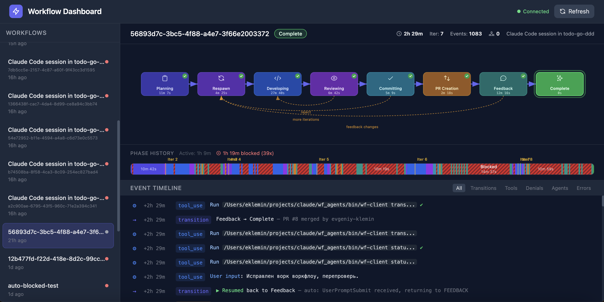

# wf-agents — Autonomous Claude Code Workflow Engine



Event-sourced state machine for autonomous Claude Code coding sessions. Tracks development phases, enforces rules via hooks, and provides a real-time web dashboard.

## Concept

Claude Code runs autonomously. wf-agents is the observer and enforcer:
- **Hooks** intercept every Claude Code action and validate permissions
- **State machine** tracks the current phase (Planning → Developing → Reviewing → ...)
- **Guards** validate transition preconditions (clean tree, CI passed, PR approved)
- **Web dashboard** displays all sessions in real time

Inspired by [NTCoding/autonomous-claude-agent-team](https://github.com/NTCoding/autonomous-claude-agent-team).

## Phases

```
PLANNING → RESPAWN → DEVELOPING → REVIEWING → COMMITTING → PR_CREATION → FEEDBACK → COMPLETE
              ↑          ↑            │            │                           │
              │          └────────────┘            │                           │
              └────────────────────────────────────┘                           │
              └────────────────────────────────────────────────────────────────┘

Any phase → BLOCKED (pause) → returns to original phase
```

| Phase | Actor | What happens |
|-------|-------|-------------|
| **PLANNING** | Team Lead | Analyze task, create plan, set up branch. Read-only — writes are blocked |
| **RESPAWN** | Team Lead | Kill old agents, spawn fresh ones with clean context |
| **DEVELOPING** | Developer agent | TDD: tests → code → refactor |
| **REVIEWING** | Reviewer agent | git diff, checklist, tests, linting → APPROVED/REJECTED |
| **COMMITTING** | Team Lead | git commit + push. Decide: more iterations or PR |
| **PR_CREATION** | Team Lead | `gh pr create --draft`, wait for CI |
| **FEEDBACK** | Team Lead | Validate PR comments, reply to each explicitly |
| **COMPLETE** | — | Terminal state |
| **BLOCKED** | — | Pause, waiting for user input |

## Quick Start

```bash
# 1. Infrastructure
docker compose up -d              # Temporal Server + UI

# 2. Build
make install                      # bin/{worker,wf-client,hook-handler,wf-web}

# 3. Worker
make worker                       # start Temporal worker

# 4. Use as Claude Code plugin in target project
cd /path/to/target-project
claude --plugin-dir /path/to/wf_agents

# 5. Inside Claude Code, start the workflow
/wf-agents:start-feature-team --task "Implement feature X"

# 6. Web dashboard (optional)
make web                          # http://localhost:8090
```

## Enforcement

### PLANNING — whitelist approach
Only read-only operations allowed: `Read`, `Glob`, `Grep`, `git status/log/diff/branch/checkout`, `gh`, test commands.
All Write/Edit and unsafe bash commands are blocked.

### RESPAWN — write ban
Edit/Write/NotebookEdit are blocked. Only agent management and reads allowed.

### Global git restrictions
`git commit/push/checkout` are forbidden everywhere, except:
- PLANNING: `git checkout` allowed (branch creation)
- COMMITTING: `git commit`, `git push` allowed

### Auto-BLOCKED
- `Stop` / `Notification` / `TeammateIdle` → automatic transition to BLOCKED
- Any active event (tool use, user prompt) → automatic unblock

## Guards (transition preconditions)

| Transition | Condition |
|------------|-----------|
| COMMITTING → any | `working_tree_clean = true` |
| DEVELOPING → REVIEWING | `working_tree_clean = false` (changes exist) |
| PR_CREATION → FEEDBACK | `pr_checks_pass = true` |
| FEEDBACK → COMPLETE | `pr_approved = true` OR `pr_merged = true` |
| RESPAWN → DEVELOPING | `activeAgents == 0` (old agents stopped) |

## CLI

```bash
wf-client start --session my-task --task "Implement feature X"
wf-client status my-task
wf-client timeline my-task
wf-client transition my-task --to DEVELOPING --reason "Plan ready"
wf-client list
```

## Architecture

```
Claude Code  ──hooks──►  hook-handler  ──signals──►  Temporal Workflow
                              │                            │
                         enforce rules              track state, guards
                              │                            │
                         deny/allow                  event timeline
                              │                            │
                         inject context              web dashboard
```

- **hook-handler** — Go binary invoked by Claude Code hooks, bridges events to Temporal
- **Temporal workflow** — event store + state machine, NOT an orchestrator
- **wf-client** — CLI for managing transitions
- **wf-web** — web dashboard with phase diagram, timeline, stuck detection

## Project Structure

```
cmd/
  worker/          Temporal worker
  client/          CLI (start, status, transition, ...)
  hook-handler/    Hooks → Temporal signals + permission enforcement
  web/             Web dashboard (Go + embedded HTML)
internal/
  model/           Phase, events, workflow types
  workflow/        State machine, guards, event sourcing
templates/         Legacy CLAUDE.md template (pre-plugin)
hooks/             hooks.json — plugin hook configuration
agents/            Subagent definitions (developer, reviewer, feature-team-lead)
commands/          Slash commands (start-feature-team, workflow, status)
.claude-plugin/    Plugin manifest
```
