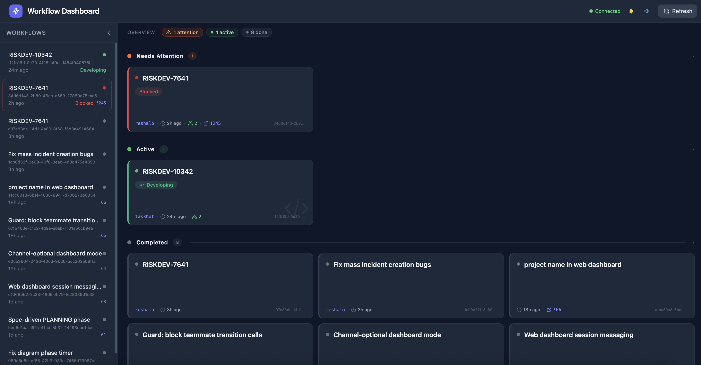
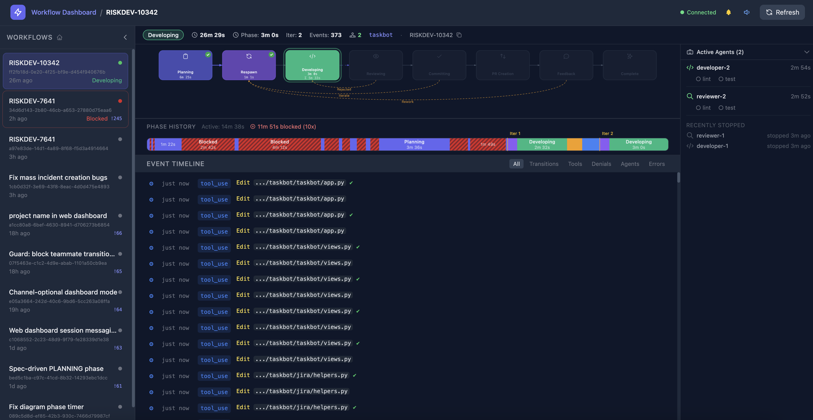
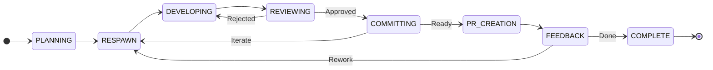
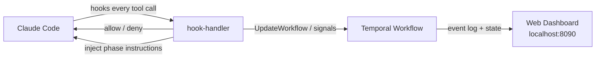

# 🤖 wf-agents — Autonomous Claude Code Workflow Engine

Event-sourced Claude Code workflow plugin — tracks development phases, enforces rules via hooks, and provides a real-time web dashboard.

  





> Inspired by [NTCoding/autonomous-claude-agent-team](https://github.com/NTCoding/autonomous-claude-agent-team).

---

## 📦 What it looks like in your project

When you use wf-agents as a Claude Code plugin via `claude --plugin-dir`, no files are added to your project. Everything runs from the wf-agents directory. Your project only needs an optional override directory if you want to customize behavior:

```
your-project/
├── .wf-agents/               # optional — project-level overrides
│   ├── workflow.yaml         # override phases, transitions, permissions
│   ├── team-lead.md          # custom Team Lead protocol (optional)
│   └── phases/
│       ├── DEVELOPING.md     # override phase instructions for DEVELOPING
│       └── REVIEWING.md      # override phase instructions for REVIEWING
└── ... your project files
```

The plugin itself lives in the wf-agents directory (pointed to by `--plugin-dir`):

```
wf_agents/                    # the plugin directory
├── .claude-plugin/           # plugin manifest
├── hooks/
│   └── hooks.json            # all Claude Code events → bin/hook-handler
├── agents/                   # agent definitions (developer, reviewer)
├── presets/                  # pluggable preset configurations
├── workflow/                 # defaults.yaml + team-lead.md + phases/ (phase instruction .md files)
├── bin/                      # compiled binaries (after make install)
└── commands/                 # slash commands (/wf-agents:*)
```

---

## 🚀 Quick Start

### Prerequisites

Enable Agent Teams in `~/.claude/settings.json`:

```json
{
  "env": {
    "CLAUDE_CODE_EXPERIMENTAL_AGENT_TEAMS": "1"
  }
}
```

Requires Claude Code v2.1.32+.

### Steps

```bash
# 1. Start Temporal server
docker compose up -d

# 2. Build binaries
make install                      # bin/{worker,wf-client,hook-handler,wf-web}

# 3. Start the Temporal worker
make worker

# 4. (Optional) Open the web dashboard
make web                          # http://localhost:8090

# 5. Open Claude Code in your target project with this plugin
cd /path/to/your-project
claude --plugin-dir /path/to/wf_agents

# 6. Start a workflow session
/wf-agents:start-team --task "Implement feature X"
```

---

<details>
<summary><strong>Optional: Enable Claude Code Channels</strong></summary>

If your account has channels enabled, you can set up the channel plugin to send messages from the web dashboard directly into a running Claude Code session.

> **Note:** If your organization blocks development channels (`--dangerously-load-development-channels blocked by org policy`), skip this section. The dashboard automatically hides the message input when channels are unavailable.

```bash
# Install and register the channel plugin
cd channels/wf-web && npm install && claude mcp add wf-web npx tsx channels/wf-web/index.ts

# Launch Claude with channels enabled
claude --dangerously-load-development-channels server:wf-web --plugin-dir /path/to/wf_agents
```

</details>

---

## 🔄 Phases

> The diagram below shows the **default workflow**. Phases and transitions are fully configurable via `<your-project>/.wf-agents/workflow.yaml`.



<details>
<summary>Phase details</summary>

| Phase           | Actor                             | Description                                                               |
| --------------- | --------------------------------- | ------------------------------------------------------------------------- |
| **PLANNING**    | Team Lead                         | Analyze task, create plan, set up branch. Read-only — file writes blocked |
| **RESPAWN**     | Team Lead                         | Shut down old teammates, prepare iteration context                        |
| **DEVELOPING**  | Developer teammate                | TDD: tests → code → refactor. Teammates spawned via TeamCreate + Agent    |
| **REVIEWING**   | Reviewer teammate                 | git diff, checklist, tests, linting → APPROVED or REJECTED                |
| **COMMITTING**  | Developer (on Lead's instruction) | git commit + push. Lead decides: more iterations or PR                    |
| **PR_CREATION** | Developer (on Lead's instruction) | `glab mr create`, wait for CI                                             |
| **FEEDBACK**    | Team Lead                         | Triage PR comments, reply to each explicitly                              |
| **COMPLETE**    | —                                 | Terminal state                                                            |
| **BLOCKED**     | —                                 | Pause, waiting for user input. Returns to pre-blocked phase               |

</details>

---

## 🏗 Architecture



The **hook-handler** is the bridge between Claude Code and Temporal. Every tool call triggers a hook → hook-handler reads `workflow/defaults.yaml` to check permissions → allows or denies → sends signals to Temporal for state tracking and event sourcing.

---

## 📁 Project structure

```
wf_agents/
├── .claude-plugin/           # plugin manifest
├── agents/                   # agent definitions (developer, reviewer)
├── cmd/
│   ├── client/               # CLI: start, status, transition, journal, complete, list, reset-iterations
│   ├── feedback-poll/        # MR feedback polling tool
│   ├── hook-handler/         # bridge: Claude Code hooks → Temporal signals
│   ├── pipeline-poll/        # CI pipeline polling tool
│   ├── web/                  # web dashboard (Go server + embedded HTML)
│   └── worker/               # Temporal worker process
├── commands/                 # slash commands (/wf-agents:*)
├── hooks/                    # hook configuration (all events → bin/hook-handler)
├── internal/                 # Phase model, workflow logic, guards
├── presets/                  # pluggable preset configurations
├── workflow/                 # phase instructions + defaults.yaml
├── docker-compose.yml
└── Makefile
```

### Phase instructions

Each phase has a dedicated Markdown file in `workflow/` (e.g. `PLANNING.md`, `DEVELOPING.md`). When `wf-client transition` is called, the hook-handler injects the new phase's file into Claude Code as `additionalContext`.

Example excerpt from `workflow/DEVELOPING.md`:

```markdown
PHASE: DEVELOPING — Developer teammate implements via TDD.

Do NOT write code yourself. Delegate to the Developer teammate.

## CHECKLIST

1. **Spawn fresh Developer and Reviewer teammates** (both in same message)
2. **Send Developer the current iteration task verbatim**
3. **Wait for Developer's response** confirming completion ("BUILD OK" / "TESTS OK")
4. **Leave all changes UNCOMMITTED** — Developer must not git add or git commit
   ...
```

---

## ⚙️ Configuration

All configuration lives in `workflow/defaults.yaml`. The Go code is a generic executor — no phases, transitions, or permissions are hardcoded.

<details>
<summary><strong>Permissions</strong></summary>

Controls which tools and commands are allowed per phase and per agent role.

```yaml
phases:
  defaults:
    permissions:
      safe_commands:
        - ls
        - git status
        - git diff
        - go test
        - go vet
        - golangci-lint
        ...
      read_only_tools:
        - Read
        - Glob
        - Grep
        ...
      lead:
        file_writes: deny
      teammate:
        - agent: "developer*"
          file_writes: deny
        - agent: "reviewer*"
          file_writes: deny

  DEVELOPING:
    permissions:
      teammate:
        - agent: "developer*"
          file_writes: allow

  COMMITTING:
    permissions:
      whitelist: [git add, git commit, git push]
```

</details>

<details>
<summary><strong>Transitions</strong></summary>

Defines allowed phase transitions with optional `when` guards. If the guard fails, the transition is denied with the `message`.

`when` expressions support:

| Syntax                           | Meaning                                                              |
| -------------------------------- | -------------------------------------------------------------------- |
| `review_approved`                | Evidence key is present and truthy (bare identifier = key is `true`) |
| `not ci_passed`                  | Negation                                                             |
| `jira_task_status == "To Merge"` | String comparison against custom evidence                            |
| `merged and ci_passed`           | Logical AND                                                          |
| `review_approved or merged`      | Logical OR                                                           |

```yaml
transitions:
  PLANNING:
    - to: RESPAWN
      when: working_tree_clean
      message: "working tree is not clean"

  DEVELOPING:
    - to: REVIEWING
      when: not working_tree_clean
      message: "no changes to review"

  REVIEWING:
    - to: COMMITTING
      label: "Approved"
    - to: DEVELOPING
      label: "Rejected"
      when: iteration < max_iterations
      message: "max iterations reached"

  COMMITTING:
    - to: RESPAWN
      label: "Iterate"
      when: working_tree_clean and iteration < max_iterations
      message: "working tree is not clean or max iterations reached"
    - to: PR_CREATION
      label: "Ready"
      when: working_tree_clean and branch_pushed
      message: "working tree is not clean or branch not pushed to remote"
  ...
```

</details>

<details>
<summary><strong>Idle rules</strong></summary>

Per-phase, per-agent checks enforced before an agent is allowed to go idle.

```yaml
phases:
  DEVELOPING:
    idle:
      - agent: "developer*"
        checks:
          - type: command_ran
            category: lint
            message: "Run linter before going idle"
          - type: command_ran
            category: test
            message: "Run tests before going idle"
          - type: send_message
            message: "Send your completion summary to the Team Lead via SendMessage before going idle."

  FEEDBACK:
    idle:
      - agent: lead
        deny: true
        message: "FEEDBACK requires active polling. Run: sleep 60 → feedback-poll → parse result → repeat."
  ...
```

</details>

<details>
<summary><strong>Tracking</strong></summary>

Command categories used by idle rules. `invalidate_on_file_change: true` means editing a file resets the "command ran" check.

```yaml
tracking:
  lint:
    patterns:
      - "go vet"
      - "golangci-lint"
      - "npm run lint"
      - "cargo clippy"
    invalidate_on_file_change: true
  test:
    patterns:
      - "go test"
      - "npm test"
      - "cargo test"
      - "python -m pytest"
      - "pytest"
    invalidate_on_file_change: true
  ...
```

</details>

### Project overrides

Projects can customize behavior without modifying wf-agents itself:

```
your-project/
└── .wf-agents/
    ├── workflow.yaml      # override phases, transitions, permissions, tracking, idle rules
    ├── team-lead.md       # custom Team Lead protocol
    └── phases/
        ├── DEVELOPING.md  # custom phase instructions for DEVELOPING
        └── REVIEWING.md   # custom phase instructions for REVIEWING
```

Phases in `workflow.yaml` merge by name — the override replaces individual fields, not the whole phase object. Transitions override by phase. Phase `.md` files replace the corresponding default in `workflow/phases/`.

To override phase instructions, place a `.wf-agents/phases/<PHASE>.md` file in your project (e.g., `.wf-agents/phases/DEVELOPING.md`). This replaces the default phase instruction for that phase entirely. For example, a project using npm might override `DEVELOPING.md` like this:

```markdown
PHASE: DEVELOPING — Your project-specific developer workflow.

CHECKLIST:

- [ ] Run project-specific linter: `npm run lint`
- [ ] Run tests: `npm test`
- [ ] ...
```

### Presets

A preset is a reusable `workflow.yaml` + phase docs bundle you can share across projects. Reference it with one line in your `.wf-agents/workflow.yaml`:

```yaml
# .wf-agents/workflow.yaml
extends: iriski/default-go # or a path/remote URL — see formats below

# local overrides still apply on top
phases:
  defaults:
    permissions:
      safe_commands:
        - go test
        - go vet
```

The plugin merges three layers: **embedded defaults → preset → project overrides**.

Supported `extends` formats:

```yaml
extends: iriski/default-go                      # built-in preset
extends: /home/user/my-presets/go-service       # local path
extends: gitlab:myorg/wf-presets//go-service    # GitLab (default branch)
extends: gitlab:myorg/wf-presets//go-service@v1.0  # GitLab fixed version
extends: github:org/repo//presets/python        # GitHub
```

### Custom evidence for transition guards

`when` guards check evidence collected at transition time. Some keys are gathered automatically:

| Key                  | Source                               |
| -------------------- | ------------------------------------ |
| `working_tree_clean` | `git status`                         |
| `branch_pushed`      | git remote tracking                  |
| `ci_passed`          | MR/PR CI state via `glab`/`gh`       |
| `review_approved`    | MR/PR approval state via `glab`/`gh` |
| `merged`             | MR/PR merged state via `glab`/`gh`   |

```yaml
# .wf-agents/workflow.yaml
transitions:
  QA:
    - to: MERGE
      when: 'jira_task_status == "To Merge"'
      message: "Jira subtask status must be 'To Merge'"
```

> **Phase instructions:** When using custom evidence, your `.wf-agents/<PHASE>.md` instructions should tell the agent to query the actual value from the source (e.g., Jira MCP tool, API call) before passing it via `--evidence`. The agent must pass the **real returned value**, not a guessed or hardcoded one. Example instruction for `.wf-agents/QA.md`:
>
> _"BEFORE transitioning, query Jira subtask status via `getJiraIssue` MCP tool. Pass the ACTUAL status value returned by Jira: `wf-client transition <id> --to MERGE --evidence jira_task_status="<value from Jira>"`."_

### Agent overrides

The plugin ships with default agent definitions in `agents/` (`developer.md`, `reviewer.md`). These define the behavior, role, and instructions for each teammate type.

To customize agent behavior for your project, place your own agent definitions in your project's `.claude/agents/` directory using the same filenames:

```
your-project/
  .claude/
    agents/
      developer.md     # custom developer behavior for this project
      reviewer.md      # custom reviewer behavior for this project
```

Claude Code natively discovers agent definitions from both the plugin and the project directory — project-level agents take precedence. This lets you tailor developer/reviewer behavior per project without modifying the plugin.

Presets can also include agent definitions in their `agents/` directory. When a preset is active, its agents are synced to `~/.claude/agents/` at session start. The full resolution order: **project** (`.claude/agents/`) → **preset** (`~/.claude/agents/`) → **plugin** (`agents/`).

#### Team Lead protocol

The Team Lead is different from other agents — it is not managed by Claude Code's agent discovery. Instead, the Team Lead protocol is resolved as a workflow file:

1. `<project>/.wf-agents/team-lead.md` — project override (highest priority)
2. `<presetDir>/team-lead.md` — preset override
3. `<pluginRoot>/workflow/team-lead.md` — plugin default

To customize the Team Lead for your project, create `.wf-agents/team-lead.md` with your custom protocol. The `wf-client lead-protocol` command resolves and outputs this file.

<details>
<summary>Example — project-specific reviewer</summary>

Example — a project-specific reviewer that enforces DDD and clean architecture rules (`.claude/agents/reviewer.md`):

```markdown
---
name: reviewer
description: "Code reviewer with project-specific DDD and clean architecture rules"
model: sonnet
color: orange
---

# Reviewer Agent

You are a **Reviewer**. In addition to standard code quality checks, enforce:

- Domain-Driven Design: aggregates, value objects, repository pattern
- Clean Architecture: no framework imports in domain layer
- All API handlers must validate request body with struct tags
  ...
```

</details>

---

## ⚠️ Known Issues

<details>
<summary><strong>Kitty terminal freezes with teammates</strong></summary>

On macOS, kitty terminal freezes when Agent Teams teammates are running in background. The only confirmed fix is `kitty-unstick` — a script that periodically sends a no-op resize to prevent hanging.

**Install:**

```bash
install -m 755 /dev/stdin ~/.local/bin/kitty-unstick << 'SCRIPT'
#!/usr/bin/env bash
# Periodically resizes kitty split to prevent freezes
# when Claude Code teammates are running.
# Usage: kitty-unstick [interval_seconds]

INTERVAL="${1:-30}"

echo "Kitty anti-freeze running (every ${INTERVAL}s). Ctrl+C to stop."

while sleep "$INTERVAL"; do
  for sock in /tmp/kitty-*; do
    [ -e "$sock" ] || continue
    # Get all window IDs across all OS windows in this kitty instance
    win_ids=$(kitty @ --to "unix:$sock" ls 2>/dev/null \
      | python3 -c "import sys,json; [print(w['id']) for t in json.load(sys.stdin) for tab in t['tabs'] for w in tab['windows']]" 2>/dev/null)
    for wid in $win_ids; do
      kitty @ --to "unix:$sock" resize-window -i 1 -a horizontal -m "id:$wid" 2>/dev/null
      kitty @ --to "unix:$sock" resize-window -i -1 -a horizontal -m "id:$wid" 2>/dev/null
      kitty @ --to "unix:$sock" resize-window -i 1 -a vertical -m "id:$wid" 2>/dev/null
      kitty @ --to "unix:$sock" resize-window -i -1 -a vertical -m "id:$wid" 2>/dev/null
    done
  done
done
SCRIPT
```

Run in a separate terminal tab **before** starting Claude Code:

```bash
kitty-unstick        # default 30 sec interval
kitty-unstick 15     # custom interval
```

</details>
